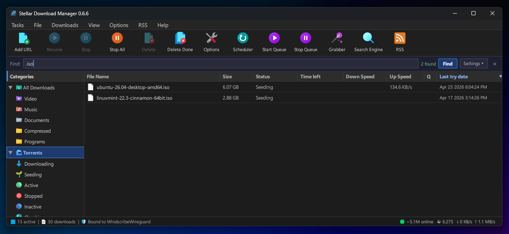
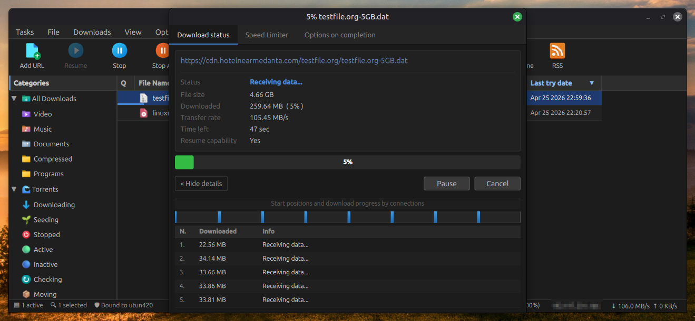
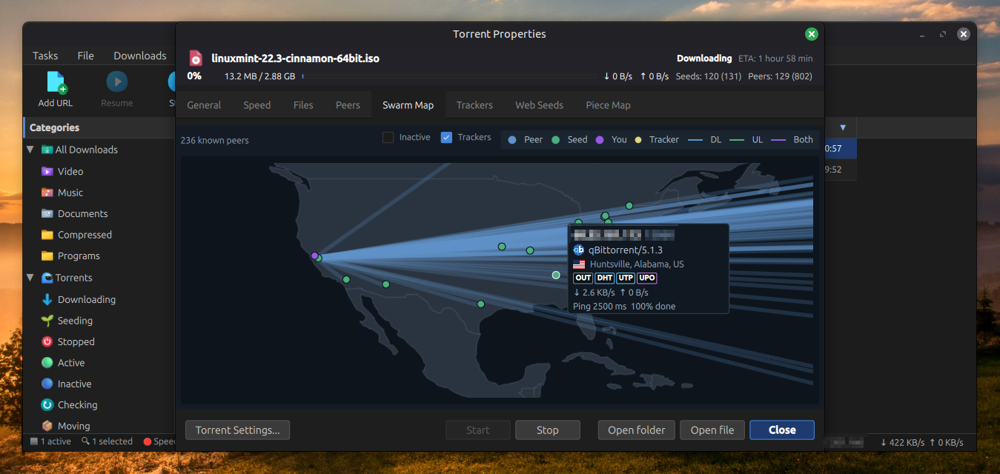

# 🌌 Stellar Download Manager

An open source download manager for Windows and Linux, inspired by IDM. Built with Qt 6 and QML

## Status

Currently work in progress

## Important message to open-source developers who do not use AI tools (human written)
The majority of Stellar was written with Claude Code! As of version 0.7.1 I've spend hundreds of dollars on credits and 3 weeks of my time making Stellar possible. I wouldn't have been able to do it without Claude.

I am NOT apologetic about that. The open source community has had over *21 years* to build an open source alternative to IDM and didn't. "Vibe coders" aren't a symptom of AI, they're a symptom of the open source community utterly failing to ship software that people actually want and use.

If you know C++, and can code without AI tools, thats great! I think it's a really cool and useful skill to have. However, please follow my advice: If you do not like the fact that Stellar was created with the help of AI, please do one of the following.

1) Either submit a pull request and submit human-written code
2) Rewrite Internet Download Manager by hand from scratch yourself

If a free, open-source download manager developed by a single person that nobody is forcing you to use bugs you, that's fine! Please keep it to yourself and mind your own business.

Pull requests are welcome. But if you just show up to complain that Stellar was built with AI, you're proving my point.

## License

[GPL v3.0](LICENSE)
