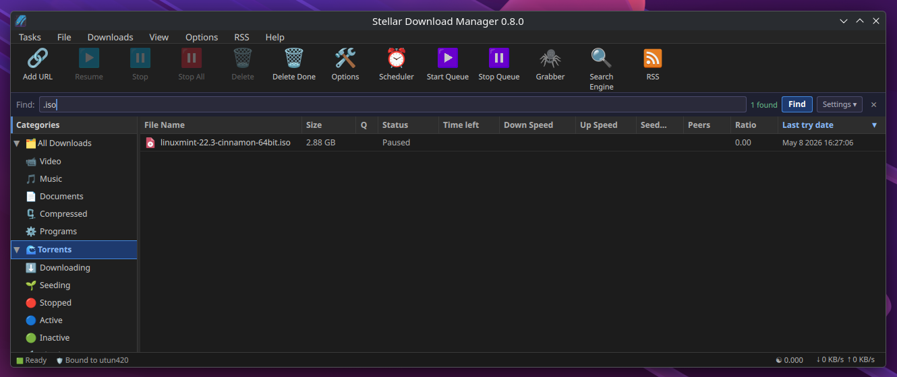
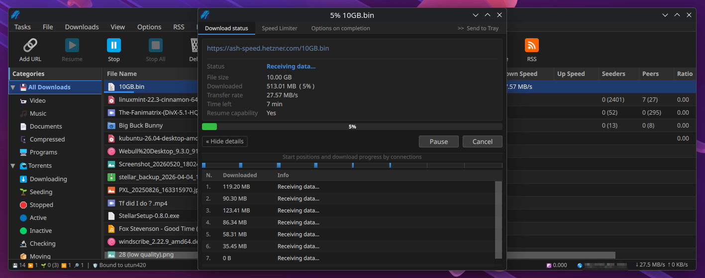
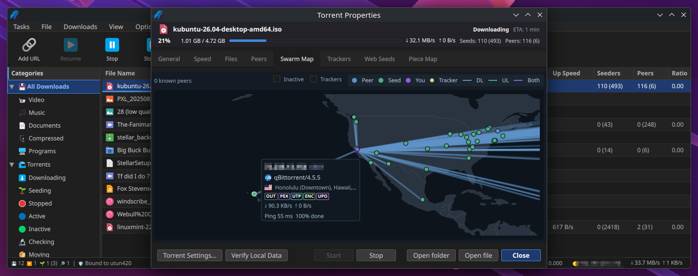

# Stellar Download Manager 🌌

A clean-room reimplementation of Internet Download Manager for Windows and Linux, with a built-in torrent client and yt-dlp support for downloading from YouTube and other video sites. Written in C++ and Qt.

<details>
<summary>Screenshots</summary>





</details>

## Status

Work in progress, but fully functional

## Features

- Splits each download into multiple parts so it finishes faster, and shifts work to the slowest part as it goes
- Pause and resume any download, including after a crash or power loss
- Browser extensions for Chrome and Firefox that sends downloads straight to Stellar (Snap version of Firefox not supported)
- Full-featured torrent client
- World map showing where your torrent peers and trackers are located
- Download videos and audio from YouTube and similar sites, with a picker for quality and format
- Site grabber that walks a website and pulls every file matching the requirements you give it
- Built in torrent search engine (compatable with qBittorrent plugins)
- Download queues with a scheduler (pick days and times)
- Speed limiter
- Categories with custom save folders
- Available in 77 languages

## How to Install 📦

Grab the latest installer from the [Releases](../../releases) page.

- Windows: download the `.exe` and run it.
- Linux (Debian / Ubuntu / Mint / Pop!_OS / …): download the `.deb`. Most desktop environments will open it in a graphical installer when you double-click it (Discover on Ubuntu/KDE, Package Installer on Linux Mint, GDebi on others). If yours doesn't, install it from a terminal:

  ```bash
  sudo apt install ./stellar_*.deb
  ```

- Linux (Fedora / RHEL / Rocky / Alma / openSUSE / …): download the `.rpm` and install it from a terminal:

  ```bash
  sudo dnf install ./stellar-*.rpm        # Fedora / RHEL family
  sudo zypper install ./stellar-*.rpm     # openSUSE
  ```

## Building 🔨

Requires CMake, Ninja, Qt 6 (Core, Quick, Network, QuickControls2, LinguistTools), Boost, and OpenSSL. libtorrent and libmaxminddb are **not bundled** - see [Third-party source dependencies](#third-party-source-dependencies) below for how to obtain them.

You will also need to download a GeoIP database for the torrent world map to work. See the [GeoIP database](#geoip-database) section below.

### Third-party source dependencies

These libraries must be placed under `third_party/` before configuring, **or** pointed to via CMake variables. The directory is excluded from version control.

#### libtorrent-rasterbar 2.0.12 (required for torrent/magnet support)

Download the release tarball from GitHub and extract it:

```bash
mkdir -p third_party
curl -L https://github.com/arvidn/libtorrent/releases/download/v2.0.12/libtorrent-rasterbar-2.0.12.tar.gz \
    | tar -xz -C third_party/
# Result: third_party/libtorrent-rasterbar-2.0.12/
```

On Windows, download from <https://github.com/arvidn/libtorrent/releases/tag/v2.0.12> and extract to `third_party\libtorrent-rasterbar-2.0.12\`.

Alternatively, point CMake at an existing source tree or installed package:

```
cmake --preset windows-debug -DLIBTORRENT_SOURCE_DIR=C:\path\to\libtorrent
# or, if already installed system-wide:
cmake --preset linux-debug -DLibtorrentRasterbar_DIR=/usr/lib/cmake/LibtorrentRasterbar
```

Without libtorrent, torrent and magnet downloads are disabled; everything else works.

#### libmaxminddb (optional - enables GeoIP world map)

**Linux:** install the system package - no manual step needed:

```bash
sudo apt install libmaxminddb-dev      # Debian / Ubuntu
sudo dnf install libmaxminddb-devel    # Fedora / RHEL
```

**Windows / manual build:** clone and place under `third_party/`:

```bash
git clone https://github.com/maxmind/libmaxminddb.git third_party/libmaxminddb
```

### Linux 🐧

```bash
sudo apt install build-essential cmake ninja-build \
    qt6-base-dev qt6-declarative-dev qt6-tools-dev qt6-tools-dev-tools \
    qml6-module-qtquick qml6-module-qtquick-controls qml6-module-qtquick-layouts \
    qml6-module-qtquick-dialogs qml6-module-qtquick-window \
    libboost-all-dev libssl-dev libmaxminddb-dev \
    python3 patchelf npm
```

Then:

```bash
cmake --preset linux-debug
cmake --build --preset linux-debug
./build/linux-debug/Stellar
```

For a release build use `linux-release` instead.

### Windows 🪟

Install:
- Visual Studio 2022 with the C++ workload
- Qt 6 from https://www.qt.io/ (MSVC 2022 64-bit), or `vcpkg install qt6`
- Boost (e.g. via vcpkg: `vcpkg install boost`)
- OpenSSL (`vcpkg install openssl`)
- Ninja (bundled with VS, or download from https://ninja-build.org/)

Set environment variables before configuring:

```
set QTDIR=C:\Qt\6.8.0\msvc2022_64
set BOOST_ROOT=C:\path\to\boost
set OpenSSL_ROOT_DIR=C:\path\to\openssl
```

Then from a "x64 Native Tools Command Prompt for VS 2022":

```
cmake --preset windows-debug
cmake --build --preset windows-debug
build\windows-debug\Stellar.exe
```

### GeoIP database

- Only needed if building from source. The torrent peer/tracker world map uses a MaxMind-format city database. Download `dbip-city-lite.mmdb` from https://db-ip.com/db/download/ip-to-city-lite and place it in `app/data/` in the repository.

## Command Line

Stellar accepts IDM-compatible flags. Both `/d` and `-d` style prefixes work.

```
Stellar /d URL [/p path] [/f filename] [/q] [/n] [/a]
Stellar /s
```

| Flag | Meaning |
|------|---------|
| `/d URL` | Download the URL |
| `/p path` | Save to this directory |
| `/f name` | Save as this filename |
| `/q` | Quit after the download finishes |
| `/n` | Silent: no dialogs, no foreground |
| `/a` | Add to queue but do not start |
| `/s` | Start the queue scheduler |

## License 📜

Copyright (C) 2026 Ninka_. Stellar is free software released under the [GNU General Public License v3.0](https://www.gnu.org/licenses/gpl-3.0.html). You may redistribute and modify it under the terms of that license. See [LICENSE](LICENSE) for the full text.

## Third-party software 💿

Stellar bundles or invokes the following third-party components. Full license texts are in [THIRD-PARTY-NOTICES.txt](THIRD-PARTY-NOTICES.txt).

- **FFmpeg** (LGPL-2.1+ / GPL-2+) - Copyright (C) 2000-present the FFmpeg developers. Used for merging video and audio streams. FFmpeg is a trademark of Fabrice Bellard. <https://ffmpeg.org/>
- **libtorrent** (BSD-3-Clause) - Copyright (C) Arvid Norberg and contributors. Used for BitTorrent protocol support. <https://libtorrent.org/>
- **yt-dlp** (The Unlicense) - yt-dlp contributors, public-domain dedication. Used for video metadata extraction and media downloading. <https://github.com/yt-dlp/yt-dlp>
- **Qt** (LGPL-3) - Copyright (C) The Qt Company Ltd. Used under the LGPL-3 with the Qt LGPL exception. <https://code.qt.io/>
- **DB-IP City Lite** (CC BY 4.0) - Geolocation database distributed under Creative Commons Attribution 4.0. <https://db-ip.com/>
- **Fluent UI System Icons** (MIT) - Copyright (C) Microsoft Corporation. UI icons used throughout the application. <https://github.com/microsoft/fluentui-system-icons>
- **Microsoft Fluent Emoji** (MIT) - Copyright (C) Microsoft Corporation. 3D emoji-style icons used throughout the application. <https://github.com/microsoft/fluentui-emoji>
